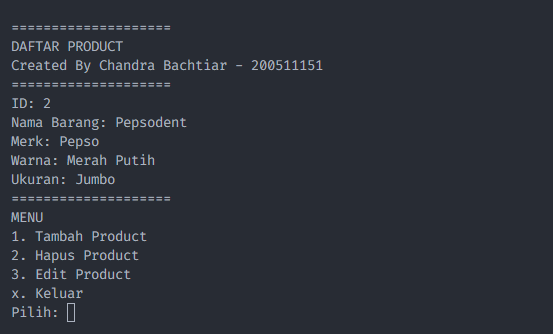

<!-- create README.md -->
# Pemrograman Visual

## Identitas

* Nama Lengkap : Chandra Bachtiar
* NIM : 200511151
* Kelas : K1 Teknik Informatika

## Penjelasan Aplikasi

Aplikasi ini dibuat dengan tujuan sebagai tugas mata kuliah Pemrograman Visual.

## Screenshot Aplikasi
<!-- insert screenshot from folder screenshot -->

## Installation
<!-- How to install this app -->
* Clone repository ini
* Buka file database.sql dan import ke database
* Buka file Database.php yang ada pada folder Config
* Sesuaikan konfigurasi database dengan database anda
* Buka Terminal/CMD dan arahkan ke folder project ini
* Ketik perintah `php App.php`
